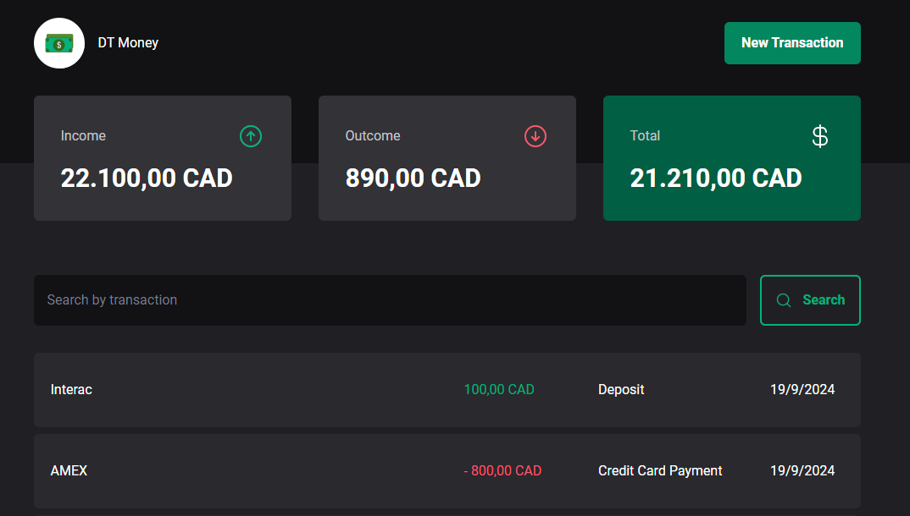

<p align="center">
  
</p>

<p align="center">
    <strong>DT Money</strong>
</p>

<p align="center">
  
  
  
  
</p>

<p align="center">
 <a href="#-About">About</a> •
 <a href="#-Functionalities">Functionalities</a> • 
 <a href="#-layout">Layout</a> • 
 <a href="#-Technologies">Technologies</a> • 
 <a href="#-Installation">Installation</a> • 
</p>

## 💻 About

Typescript React Application to control cash flow (exercise only)

<p align="center">
  
</p>

## ☑ Functionalities

- Creat a list of money income and outcome
- Show a Summary of the total income
- Show the difference between total income vs outcome
- Filter results based on text search

## 🎨 Layout

### Figma File

[Figma Mock](https://www.figma.com/community/file/1138814493269096792/dt-money)

## 🔨 Technologies

The following framworks/libraries were used for this project:

- **[ReactJS](https://reactjs.org/)**
- **[TypeScript](https://www.typescriptlang.org/)**
- **[Tailwind](https://tailwindcss.com)**
- **[RadixUI](https://www.radix-ui.com)**
- **[Vite](https://vitejs.dev/)**

> Check the full [package.json](https://github.com/flavioccf/react_dt_money/blob/main/package.json)


## 🚀 Installation

```bash
# Clone the repo
git clone https://github.com/flavioccf/react_dt_money.git

# Access the project
cd react_dt_money

# Install dependencies
npm install

# Run the application
npm run dev # will run vite application
npm run dev:server # will run json server
npm run dev:all # will run both concurrently

```